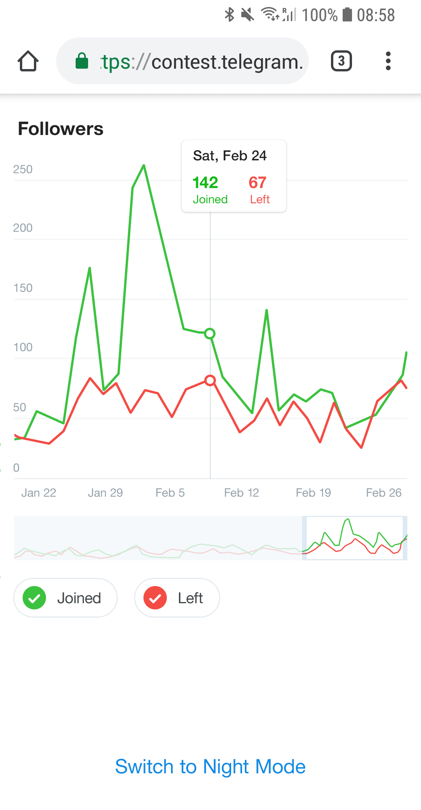

# Telegram chart

This is a JS solution for [the Telegram March 2019 coding contest](http://t.me/contest/6).
The goal was to develop an application for showing simple charts based on [the input data](src/chart_data.json).

About the input data format

The JSON file is an input data for the 5 charts. It contains a vector of JSON objects ('chart'), each representing a separate graph.

chart.columns – List of all data columns in the chart. Each column has its label at position 0, followed by values.
x values are UNIX timestamps in milliseconds.

chart.types – Chart types for each of the columns. Supported values:
"line" (line on the graph with linear interpolation),
"x" (x axis values for each of the charts at the corresponding positions).

chart.colors – Color for each line in 6-hex-digit format (e.g. "#AAAAAA").
chart.names – Names for each line.

Specialized charting libraries were not allowed.
The criteria were using to define the winner are speed, efficiency and the size of the app.

This is how the chart application should work: [video](docs/charts.mp4)

|Day|Night|
|-----|-----|
|||

## How to start the application

First install the application:

1. Make sure you have [Node.js](http://nodejs.org) installed
2. Download the source code
3. Open a terminal and go to the source code directory
4. Run `npm install`

### Development mode

1. Run `npm start`
2. Open http://localhost:8000 in a browser

### Production mode

1. Run `npm run build`
2. Open the `dist/index.html` file in a browser

If you want to serve the application with a web server,
upload the content of the `dist` directory to the web server and make the directory be the document root of the server. 

## Architecture concepts

Both SVG and canvas are too slow for Telegram so I decided to use WebGL.
The WebGL render is implemented using [PixiJS](http://pixijs.com).
The DOM is manipulated using a pure JS to make it fast and the code small.

The chart supports multiple touches.

The source code is compiled to the distributive code using [Webpack](http://webpack.js.org) and [Babel](http://babeljs.io).
